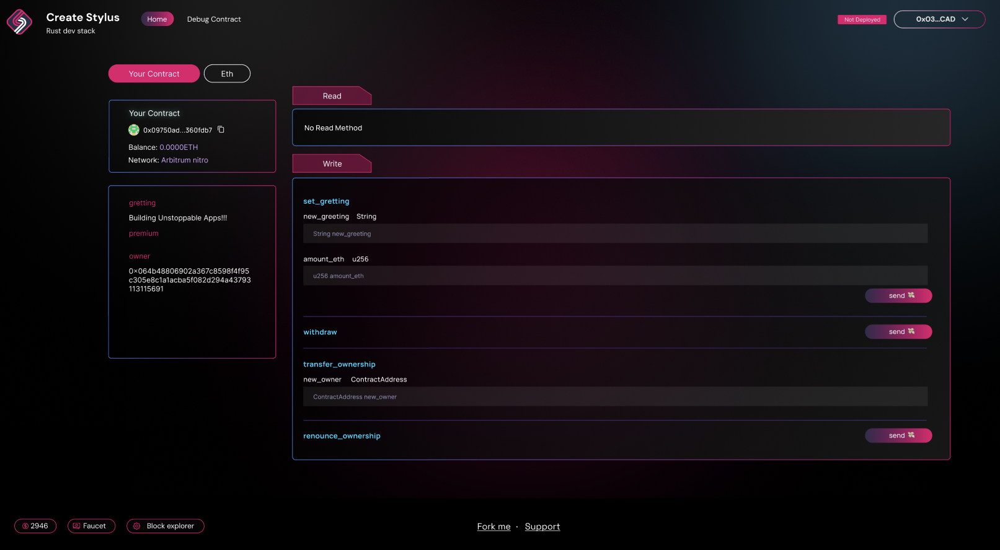

# 🏗 scaffold-stylus

<h4 align="center">
  <a href="">Documentation</a> |
  <a href="https://drone-cure-43592424.figma.site/">Website</a>
</h4>

🧪 An open-source, up-to-date toolkit for building decentralized applications (dapps) on the Arbitrum blockchain. It's designed to make it easier for developers to create and deploy smart contracts and build user interfaces that interact with those contracts.

⚙️ Built using NextJS, RainbowKit, Stylus, Wagmi, Viem, and Typescript.

- ✅ **Contract Hot Reload**: Your frontend auto-adapts to your smart contract as you edit it.
- 🪝 **[Custom hooks]()**: Collection of React hooks wrapper around [wagmi](https://wagmi.sh/) to simplify interactions with smart contracts with typescript autocompletion.
- 🧱 [**Components**](): Collection of common web3 components to quickly build your frontend.
- 🔥 **Burner Wallet & Local Faucet**: Quickly test your application with a burner wallet and local faucet.
- 🔐 **Integration with Wallet Providers**: Connect to different wallet providers and interact with the Arbitrum network.



## Requirements

Before you begin, you need to install the following tools:

- [Node (>= v18.17)](https://nodejs.org/en/download/)
- Yarn ([v1](https://classic.yarnpkg.com/en/docs/install/) or [v2+](https://yarnpkg.com/getting-started/install))
- [Git](https://git-scm.com/downloads)
- [Rust](https://www.rust-lang.org/tools/install)
- [Docker](https://docs.docker.com/engine/install/)
- [Foundry Cast](https://getfoundry.sh/)

## Quickstart

[Video Demo](https://app.screencastify.com/watch/9GYnnO0Fqq9QOjYRjQg0)

To get started with Scaffold-Stylus, follow the steps below:

1. Clone this repo & install dependencies

```
git clone https://github.com/Arb-Stylus/scaffold-stylus.git
cd scaffold-stylus
yarn install
# Initialize submodules (required for Nitro dev node)
git submodule update --init --recursive
```

2. Run a local network in the first terminal:

```
yarn chain
```

This command starts a local Stylus-compatible network using the Nitro dev node script (`./packages/stylus/nitro-devnode/run-dev-node.sh`). The network runs on your local machine and can be used for testing and development. You can customize the Nitro dev node configuration in the `nitro-devnode` submodule.

3. On a second terminal, deploy the test contract:

```
yarn deploy
```

This command deploys a test smart contract to the local network. The contract is located in `packages/stylus/src` and can be modified to suit your needs. The `yarn deploy` command uses the deploy script located in `packages/stylus/scripts` to deploy the contract to the network. You can also customize the deploy script.

4. On a third terminal, start your NextJS app:

```
yarn start
```

Visit your app on: `http://localhost:3000`. You can interact with your smart contract using the `Debug Contracts` page. You can tweak the app config in `packages/nextjs/scaffold.config.ts`.

Run smart contract test with `yarn stylus:test`

- Edit your smart contract `lib.rs` in `packages/stylus/src`
- Edit your frontend in `packages/nextjs/pages`
- Edit your deployment scripts in `packages/stylus/scripts`

## Deploying to Other Chains

To deploy your contracts to a different network (other than the default local Nitro dev node), you need to update a few configuration options:

1. **Set the RPC URL**

   - Specify the target network's RPC endpoint in the `RPC_URL` environment variable. You can do this in your shell or by creating a `.env` file (see `.env.example` for reference).
   - Example:

     ```env
     RPC_URL=https://your-network-rpc-url
     ```

2. **Set the Private Key**

   - If you want to deploy using your own wallet, set the `PRIVATE_KEY` environment variable to your wallet's private key. By default, a development key is used when running the Nitro dev node locally, but for real deployments you must provide your own.
   - Example:

     ```env
     PRIVATE_KEY=your_private_key_here
     ```

3. **Update the Target Chain in the Frontend**

   - Open `packages/nextjs/scaffold.config.ts` and change the `targetNetworks` array to include the correct chain for your deployment. This ensures the frontend connects to the right network and that the ABI is generated correctly in `deployedContracts.ts`.
   - Example:

     ```ts
     import { mainnet } from "viem/chains";
     // ...
     targetNetworks: [mainnet],
     ```

**Note:**

- The values in `.env.example` provide a template for the required environment variables.
- The chain specified in `scaffold.config.ts` is used to generate the ABI and populate `deployedContracts.ts` for your frontend.
- Always keep your private key secure and never commit it to version control.

## Documentation

Visit our [docs](#) to learn how to start building with Scaffold-Stylus.

To know more about its features, check out our [website](https://drone-cure-43592424.figma.site).

## Contributing to Scaffold-Stylus

We welcome contributions to Scaffold-Stylus!

Please see [CONTRIBUTING.md](https://github.com/Arb-Stylus/scaffold-stylus/blob/main/CONTRIBUTING.md) for more information and guidelines for contributing to Scaffold-Stylus.
