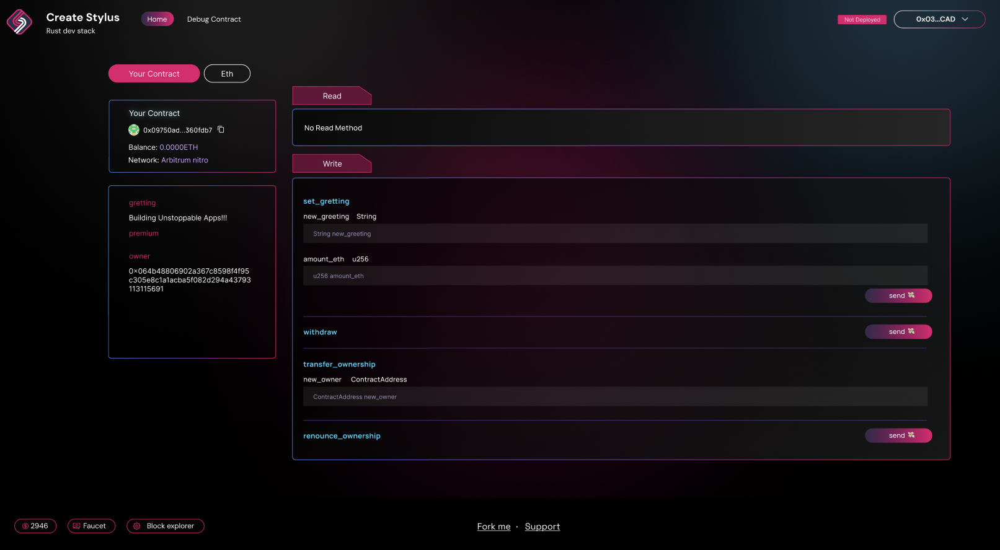

# 🏗 scaffold-stylus

<h4 align="center">
  <a href="https://arb-stylus.github.io/scaffold-stylus-docs/">Documentation</a> |
  <a href="https://www.scaffoldstylus.com/">Website</a>
</h4>

🧪 An open-source, up-to-date toolkit for building decentralized applications (dapps) on the Arbitrum blockchain. It's designed to make it easier for developers to create and deploy smart contracts and build user interfaces that interact with those contracts.

⚙️ Built using Rust, NextJS, RainbowKit, Stylus, Wagmi, Viem, and TypeScript.

- ✅ **Contract Hot Reload**: Your frontend auto-adapts to your smart contract as you edit it.
- 🪝 **[Custom hooks]()**: Collection of React hooks wrapped around [wagmi](https://wagmi.sh/) to simplify interactions with smart contracts with TypeScript autocompletion.
- 🧱 [**Components**](): Collection of common web3 components to quickly build your frontend.
- 🔥 **Burner Wallet & Local Faucet**: Quickly test your application with a burner wallet and local faucet.
- 🔐 **Integration with Wallet Providers**: Connect to different wallet providers and interact with the Arbitrum network.



## Requirements

Before you begin, you need to install the following tools:

- [Node (>= v18.17)](https://nodejs.org/en/download/)
- Yarn ([v1](https://classic.yarnpkg.com/en/docs/install/) or [v2+](https://yarnpkg.com/getting-started/install))
- [Git](https://git-scm.com/downloads)
- [Rust](https://www.rust-lang.org/tools/install)
- [Docker](https://docs.docker.com/engine/install/)
- [Foundry Cast](https://getfoundry.sh/)

## Quickstart

[Video Demo](https://app.screencastify.com/watch/9GYnnO0Fqq9QOjYRjQg0)

To get started with Scaffold-Stylus, follow the steps below:

1. Clone this repo & install dependencies

```
git clone https://github.com/Arb-Stylus/scaffold-stylus.git
cd scaffold-stylus
yarn install
# Initialize submodules (required for Nitro dev node)
git submodule update --init --recursive
```

2. Run a local network in the first terminal:

```
yarn chain
```

This command starts a local Stylus-compatible network using the Nitro dev node script (`./nitro-devnode/run-dev-node.sh`). The network runs on your local machine and can be used for testing and development. You can customize the Nitro dev node configuration in the `nitro-devnode` submodule.

3. On a second terminal, deploy the test contract:

```
yarn deploy
```

This command deploys a test smart contract to the local network. The contract is located in `packages/stylus/your-contract/src` and can be modified to suit your needs. The `yarn deploy` command uses the deploy script located in `packages/stylus/scripts` to deploy the contract to the network. You can also customize the deploy script.

4. On a third terminal, start your NextJS app:

```
yarn start
```

Visit your app at: `http://localhost:3000`. You can interact with your smart contract using the `Debug Contracts` page. You can tweak the app config in `packages/nextjs/scaffold.config.ts`.

Run smart contract tests with `yarn stylus:test`

- Edit your smart contract `lib.rs` in `packages/stylus/your-contract/src`
- Edit your frontend in `packages/nextjs/pages`
- Edit your deployment scripts in `packages/stylus/scripts`

## Create Your Own Contract

Scaffold-Stylus enables you to create and deploy multiple contracts within a single project. Follow the steps below to create and deploy your own contracts.

### Step 1: Generate New Contract

Use the following command to create a new contract and customize it as needed:

```
yarn new-module <contract-name>
```

The generated contract will be located in `packages/stylus/<contract-name>`.

### Step 2: Deploy Your Contract

Deploy your contract using one of the following methods:

#### Method A: Deploy with Script (Recommended)

```
yarn deploy
```

This command runs the `deploy.ts` script located in `packages/stylus/scripts`. You can customize this script with your deployment logic.

#### Method B: Deploy Single Contract Directly

If you prefer not to write a deployment script, you can deploy a single contract directly:

```
yarn deploy --contract <contractFolder> [...options]
```

**Available Options:**

- `--name <contractName>`: Deploy your contract with a custom name (default is the contract folder name)
- `--network <network>`: Specify which network to deploy to
- `--estimate-gas`: Only perform gas estimation without deploying
- `--max-fee=<maxFee>`: Set maximum fee per gas in gwei

#### Method C: Deploy All Contracts

Deploy all contracts in your project with a single command:

```
yarn deploy --all [...options]
```

**Note:** Deployment information is automatically saved in `packages/stylus/deployments` by default.

## Deploying to Other Networks

To deploy your contracts to other networks (other than the default local Nitro dev node), you'll need to configure your RPC endpoint and wallet credentials.

### Prerequisites

1. **Set the RPC URL**

   Configure your target network's RPC endpoint using the proper `RPC_URL_<network>` environment variable. You can set this in your shell or create a `.env` file (see `.env.example` for reference):

   ```env
   RPC_URL_SEPOLIA=https://your-network-rpc-url
   ```

2. **Set the Private Key**

   For real deployments, you must provide your own wallet's private key. Set the `PRIVATE_KEY_<network>` environment variable:

   ```env
   PRIVATE_KEY_SEPOLIA=your_private_key_here
   ```

   **Security Note:** A development key is used by default when running the Nitro dev node locally, but for external deployments, you must provide your own private key.

3. **Update Frontend Configuration**

   Open `packages/nextjs/scaffold.config.ts` and update the `targetNetworks` array to include your target chain. This ensures your frontend connects to the correct network and generates the proper ABI in `deployedContracts.ts`:

   ```ts
   import * as chains from "viem/chains";
   // ...
   targetNetworks: [chains.arbitrumSepolia],
   ```

### Deploy to Other Network

Once configured, deploy to your target network:

```
yarn deploy --network <network>
```

**Important Security Notes:**

- The values in `.env.example` provide a template for required environment variables

- **Always keep your private key secure and never commit it to version control**
- Consider using environment variable management tools for production deployments

## Documentation

Visit our [docs](https://arb-stylus.github.io/scaffold-stylus-docs/) to learn how to start building with Scaffold-Stylus.

To learn more about its features, check out our [website](https://www.scaffoldstylus.com/).

## Contributing to Scaffold-Stylus

We welcome contributions to Scaffold-Stylus!

Please see [CONTRIBUTING.md](https://github.com/Arb-Stylus/scaffold-stylus/blob/main/CONTRIBUTING.md) for more information and guidelines for contributing to Scaffold-Stylus.
